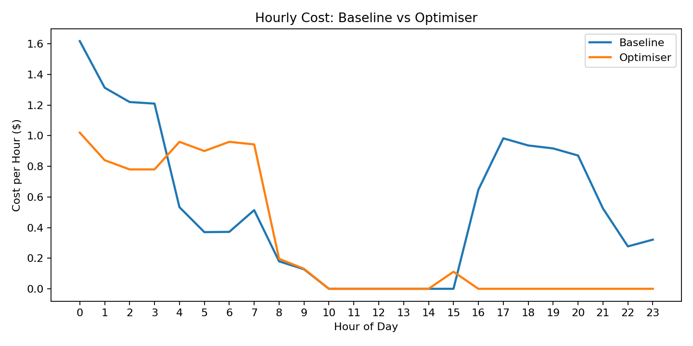
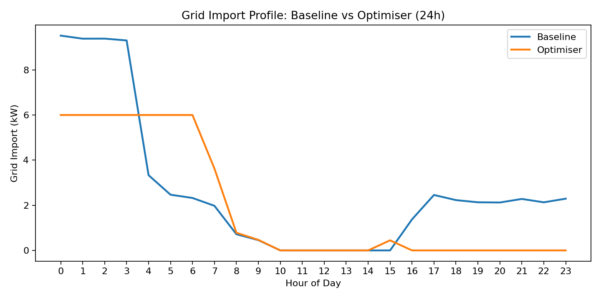
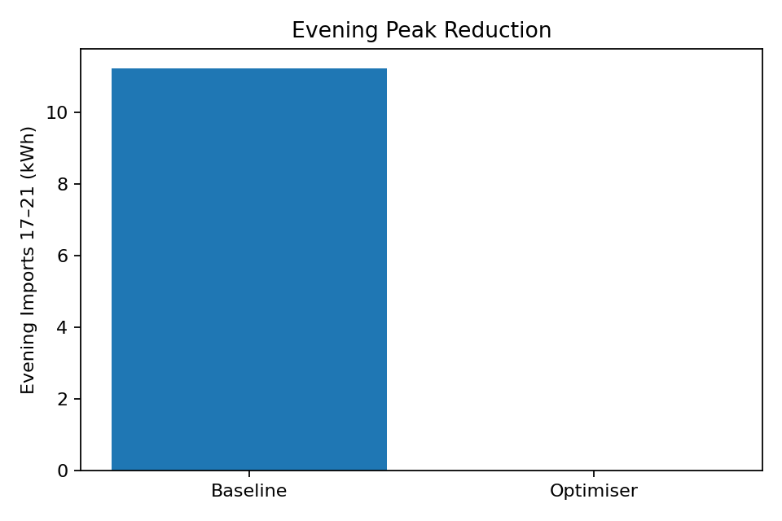

# Smart Home Energy Optimiser

## Overview
The **Smart Home Energy Optimiser** is a Python-based simulation that demonstrates how households can reduce costs and support grid stability.  
It integrates smart appliances, solar generation, battery storage, and EV charging into a coordinated energy management system.

The optimiser schedules loads based on:
- 24-hour energy price forecasts  
- Carbon intensity signals  
- Solar generation patterns  
- Network congestion (peak demand vs off-peak periods)

This project also explores the interaction between **distribution (household devices)** and **transmission-level grid support**, showing how consumer behaviour can contribute to system reliability.

---

## Key Features
- **Battery Dispatch Control**: Charges during low-price, low-demand hours and discharges during peaks.  
- **EV Charging Management**: Smart scheduling ensures the EV is ready by morning while avoiding costly evening peaks.  
- **Dynamic Thermostat Control**: Switches between pre-cool, conserve, and default modes based on real-time pricing.  
- **Solar Integration**: Prioritises self-consumption, feeds excess to the grid, and charges the battery when possible.  
- **Carbon Tracking**: Calculates cumulative emissions to compare environmental impact under baseline vs optimised scenarios.  
- **Scenario Analysis**: Compares a “do-nothing” baseline against the optimiser, highlighting cost and peak reduction benefits.

---

## Results

### Cost Reduction
The optimiser cut daily household energy costs compared to the baseline scenario.



### Grid Import Profile
The optimiser shifted demand away from expensive and carbon-intensive peak hours.



### Evening Peak Reduction
Significant reductions were achieved in evening demand, supporting grid stability.



---

## Data Outputs
The optimiser generates two CSVs for further analysis:
- **`results_summary.csv`** – Daily totals (cost, carbon emissions, peak imports).  
- **`hourly_series.csv`** – Hourly time-series of demand, generation, and prices.  

You can open these files in Excel, Tableau, or Python (Pandas) for additional insights.

---

## Technical Stack
- **Python 3.10+**
- Libraries: `numpy`, `matplotlib`, `pandas`
- Modular code for easy extension (e.g., add demand response signals, dynamic tariffs, or network constraints)

---

## Applications
This project can be extended to:
- Virtual Power Plant (VPP) simulations  
- Demand-side management research  
- Transmission & distribution planning support  
- Policy and tariff design evaluation  

---

## How to Run
1. Clone this repository.  
2. Install dependencies:  
   ```bash
   pip install -r requirements.txt
   'python optimiser_super_advanced.py'
